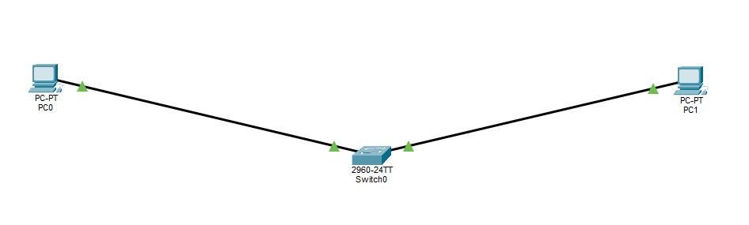

# Lab 1: Basic 2-PC LAN

## Network topology

## IP Configuration
- **PC0:** `192.168.1.10/24`
- **PC1:** `192.168.1.11/24`

## Status
- [X] Switch connection active
- [X] Ping verified between PC0 and PC1